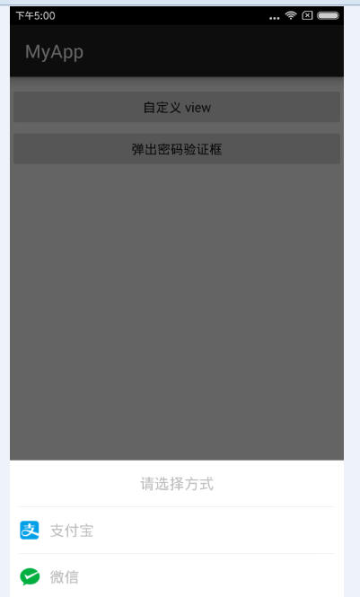
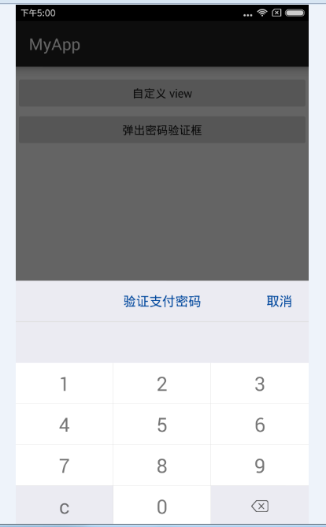
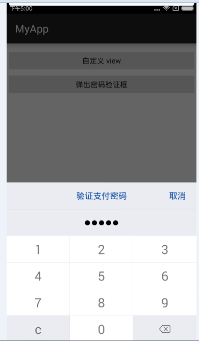
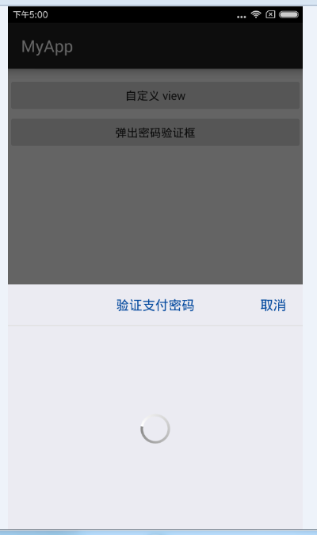
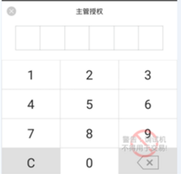

## 使用DialogFragment实现类似微信支付宝的安全键盘

### 1效果图

**自定义的view**

**验证密码框**
  


### 2实现

>文中使用了一个开源的自定义BottomDialog

**2.1 自定义的view**

**MainActivity中使用**

```java
 private void showButtomSelectDialog() {
        final BottomDialog mDialog = BottomDialog.create(getSupportFragmentManager());

        mDialog.setViewListener(new BottomDialog.ViewListener() {
            @Override
            public void bindView(View v) {
                TextView tv1 = (TextView) v.findViewById(R.id.pay_wechat_tv);
                TextView tv2 = (TextView) v.findViewById(R.id.pay_alipay_tv);

                tv1.setOnClickListener(new View.OnClickListener() {
                    @Override
                    public void onClick(View v) {
                        Toast.makeText(MainActivity.this, "微信支付", Toast.LENGTH_SHORT).show();
                        mDialog.dismiss();
                    }
                });
                tv2.setOnClickListener(new View.OnClickListener() {
                    @Override
                    public void onClick(View v) {
                        Toast.makeText(MainActivity.this, "支付宝支付", Toast.LENGTH_SHORT).show();
                        mDialog.dismiss();
                    }
                });
            }
        })
                .setLayoutRes(R.layout.buttom_select_dialog)
                .setDimAmount(0.6f)
                .setTag("BottomDialog")
                .show();

    }
```
**buttom_select_dialog布局文件**
```xml
<RelativeLayout xmlns:android="http://schemas.android.com/apk/res/android"
    android:layout_width="match_parent"
    android:layout_height="match_parent" >

    <LinearLayout
        style="@style/fill_wrap"
        android:layout_alignParentBottom="true"
        android:background="@color/white"
        android:orientation="vertical" >

        <TextView
            style="@style/text_column"
            android:drawableLeft="@null"
            android:drawableRight="@null"
            android:gravity="center"
            android:text="请选择方式" />

        <View
            style="@style/h_line"
            android:layout_marginLeft="@dimen/dimens_10dp"
            android:layout_marginRight="@dimen/dimens_10dp" />

        <TextView
            android:id="@+id/pay_alipay_tv"
            style="@style/text_column"
            android:drawableLeft="@mipmap/icon_alipay_s"
            android:drawablePadding="@dimen/dimens_10dp"
            android:text="@string/scan_by_alipay" />

        <View
            style="@style/h_line"
            android:layout_marginLeft="@dimen/dimens_10dp"
            android:layout_marginRight="@dimen/dimens_10dp" />

        <TextView
            android:id="@+id/pay_wechat_tv"
            style="@style/text_column"
            android:drawableLeft="@mipmap/icon_wechat_s"
            android:drawablePadding="@dimen/dimens_10dp"
            android:text="@string/scan_by_wechat" />
    </LinearLayout>

</RelativeLayout>
```

**2.2 密码框实现**

**自定义的密码框**

```java
public class ManagerPwdView implements OnClickListener{

	private Context mContext;

	private static int NUMBER_COUNT = 6;
	private final static String PASSWORD_NUMBER_SYMBOL = "●";

	private OnInputNumberCodeCallback mCallback; // 返回结果的回调
	private Stack<Integer> mStack;

	private View view;
	private TextView tv_payment_pwd;
	private TextView tv0;
	private TextView tv1;
	private TextView tv2;
	private TextView tv3;
	private TextView tv4;
	private TextView tv5;
	private TextView tv6;
	private TextView tv7;
	private TextView tv8;
	private TextView tv9;
	private TextView tv_clean;
	private RelativeLayout relat_del;
	private TextView tv_dismiss;
	private TextView tv_title;
	private ProgressBar progressBar;
	private int mType = 0;


	/**
	 * @param mContext
	 * @param type 0为验证 1为修改
	 */
	public ManagerPwdView(Context mContext , int type) {
		this.mContext = mContext;
		this.mStack = new Stack<>();
		this.mType = type;
		initView();

	}


	@SuppressLint("InflateParams") 
	private void initView() {
		view = LayoutInflater.from(mContext).inflate(R.layout.view_payment_pwd, null);
		this.tv_payment_pwd = (TextView) view.findViewById(R.id.tv_payment_pwd);
		this.tv0 = (TextView) view.findViewById(R.id.tv0);
		this.tv1 = (TextView) view.findViewById(R.id.tv1);
		this.tv2 = (TextView) view.findViewById(R.id.tv2);
		this.tv3 = (TextView) view.findViewById(R.id.tv3);
		this.tv4 = (TextView) view.findViewById(R.id.tv4);
		this.tv5 = (TextView) view.findViewById(R.id.tv5);
		this.tv6 = (TextView) view.findViewById(R.id.tv6);
		this.tv7 = (TextView) view.findViewById(R.id.tv7);
		this.tv8 = (TextView) view.findViewById(R.id.tv8);
		this.tv9 = (TextView) view.findViewById(R.id.tv9);
		this.tv_clean = (TextView) view.findViewById(R.id.tv_clean);
		this.relat_del = (RelativeLayout) view.findViewById(R.id.relat_del);
		this.tv_dismiss = (TextView) view.findViewById(R.id.tv_dismiss);
		this.tv_title = (TextView) view.findViewById(R.id.tv_title);
		this.progressBar = (ProgressBar) view.findViewById(R.id.progressBar);

		if( mType == 0 )
			this.tv_title.setText("验证支付密码");
		else 
			this.tv_title.setText("设置支付密码");

		this.tv0.setOnClickListener(this);
		this.tv1.setOnClickListener(this);
		this.tv2.setOnClickListener(this);
		this.tv3.setOnClickListener(this);
		this.tv4.setOnClickListener(this);
		this.tv5.setOnClickListener(this);
		this.tv6.setOnClickListener(this);
		this.tv7.setOnClickListener(this);
		this.tv8.setOnClickListener(this);
		this.tv9.setOnClickListener(this);
		this.tv_clean.setOnClickListener(this);
		this.relat_del.setOnClickListener(this);
		this.tv_dismiss.setOnClickListener(this);

	}


	@Override
	public void onClick(View v) {
		switch (v.getId()) {
		case R.id.tv0:
			numberClick(0);
			break;
		case R.id.tv1:
			numberClick(1);
			break;
		case R.id.tv2:
			numberClick(2);
			break;
		case R.id.tv3:
			numberClick(3);
			break;
		case R.id.tv4:
			numberClick(4);
			break;
		case R.id.tv5:
			numberClick(5);
			break;
		case R.id.tv6:
			numberClick(6);
			break;
		case R.id.tv7:
			numberClick(7);
			break;
		case R.id.tv8:
			numberClick(8);
			break;
		case R.id.tv9:
			numberClick(9);
			break;
		case R.id.tv_clean:
			numberClick(10);
			break;
		case R.id.relat_del:
			numberClick(11);
			break;
		case R.id.tv_dismiss:
			mCallback.onClose();
			break;

		default:
			break;
		}
	}

	/**
	 * 将点击事件传来
	 * @param num
	 */
	public void numberClick(int num){

		if (num == 10) {
			clearnNumber();
			return;
		}

		if( num <= 9){
			mStack.push(num);
		}else if(num == 11){
			deleteNumber();
		}

		refreshNumberViews(mStack);
		//input 6 numbers complete
		if (mStack.size() == NUMBER_COUNT) {
			StringBuilder codeBuilder = new StringBuilder();
			for (int number : mStack) {
				codeBuilder.append(number);
			}
			validation(codeBuilder.toString());
		}

	}

	/**
	 * 验证字符串
	 * @param string
	 */
	private void validation(final String string) {
		progressBar.setVisibility(View.VISIBLE);


		new Handler().postDelayed(new Runnable() {

			@Override
			public void run() {
				clearnNumber();
				progressBar.setVisibility(View.GONE);
				if(string.equals("123456")) {
					Toast.makeText(mContext, R.string.success, Toast.LENGTH_SHORT).show();
					mCallback.onSuccess();
				}else {
					Toast.makeText(mContext, R.string.failure, Toast.LENGTH_SHORT).show();
				}
			}
		}, 1000);
	}


	/**
	 * 刷新输入框显示
	 * @param mNumberStack
	 */
	public void refreshNumberViews(Stack<Integer> mNumberStack) {
		StringBuffer numStr = new StringBuffer();

		for (int i = 0; i < mNumberStack.size(); i++) {
			numStr.append(PASSWORD_NUMBER_SYMBOL);
		}
		tv_payment_pwd.setText(numStr);
	}

	/**
	 * 清空mNumberStack的内容并刷新密码格
	 */
	public void clearnNumber() {
		mStack.clear();
		refreshNumberViews(mStack);
	}

	/**
	 * 删除密码位数
	 */
	public void deleteNumber() {
		if (mStack.empty() || mStack.size() > NUMBER_COUNT) {
			return;
		}
		mStack.pop();
	}

	/**
	 * 返回输出的结果
	 */
	public interface OnInputNumberCodeCallback {
		void onSuccess();
		void onClose();
	}

	public void setInputNumberCodeCallback(OnInputNumberCodeCallback callback) {
		this.mCallback = callback;
	}

	public View getView() {
		return view;
	}
	}
```

**view_payment_pwd 布局文件**

```xml
<?xml version="1.0" encoding="utf-8"?>
<RelativeLayout xmlns:android="http://schemas.android.com/apk/res/android"
    android:layout_width="match_parent"
    android:layout_height="wrap_content"
    android:orientation="vertical" >

    <LinearLayout
        style="@style/fill_wrap"
        android:layout_alignParentBottom="true"
        android:orientation="vertical" >

        <RelativeLayout
            style="@style/input_layout"
            android:layout_height="@dimen/dimens_50dp"
            android:background="@color/bg_gray" >

            <TextView
                android:id="@+id/tv_title"
                style="@style/wrap_wrap"
                android:layout_centerInParent="true"
                android:text=""
                android:textColor="@color/text_blue"
                android:textSize="@dimen/text_h3" />

            <TextView
                android:id="@+id/tv_dismiss"
                style="@style/wrap_wrap"
                android:layout_alignParentRight="true"
                android:layout_centerVertical="true"
                android:padding="@dimen/dimens_10dp"
                android:text="取消"
                android:textColor="@color/text_blue"
                android:textSize="@dimen/text_h3" />
        </RelativeLayout>

        <View
            style="@style/h_line"
            android:layout_height="@dimen/dimens_1dp" />

        <FrameLayout
            android:layout_width="match_parent"
            android:layout_height="@dimen/dimens_250dp" >

            <LinearLayout
                style="@style/fill_wrap"
                android:orientation="vertical" >

                <TextView
                    android:id="@+id/tv_payment_pwd"
                    style="@style/text_basic"
                    android:layout_height="@dimen/dimens_50dp"
                    android:background="@color/bg_gray"
                    android:gravity="center"
                    android:text=""
                    android:textColor="@color/black"
                    android:textSize="@dimen/text_h0" />

                <LinearLayout
                    style="@style/layout_payment_pwd"
                    android:orientation="horizontal" >

                    <TextView
                        android:id="@+id/tv1"
                        style="@style/text_full"
                        android:layout_gravity="center"
                        android:text="@string/number_1" />

                    <View style="@style/v_line" />

                    <TextView
                        android:id="@+id/tv2"
                        style="@style/text_full"
                        android:layout_gravity="center"
                        android:text="@string/number_2" />

                    <View style="@style/v_line" />

                    <TextView
                        android:id="@+id/tv3"
                        style="@style/text_full"
                        android:layout_gravity="center"
                        android:text="@string/number_3" />
                </LinearLayout>

                <View style="@style/h_line" />

                <LinearLayout
                    style="@style/layout_payment_pwd"
                    android:orientation="horizontal" >

                    <TextView
                        android:id="@+id/tv4"
                        style="@style/text_full"
                        android:layout_gravity="center"
                        android:text="@string/number_4" />

                    <View style="@style/v_line" />

                    <TextView
                        android:id="@+id/tv5"
                        style="@style/text_full"
                        android:layout_gravity="center"
                        android:text="@string/number_5" />

                    <View style="@style/v_line" />

                    <TextView
                        android:id="@+id/tv6"
                        style="@style/text_full"
                        android:layout_gravity="center"
                        android:text="@string/number_6" />
                </LinearLayout>

                <View style="@style/h_line" />

                <LinearLayout
                    style="@style/layout_payment_pwd"
                    android:orientation="horizontal" >

                    <TextView
                        android:id="@+id/tv7"
                        style="@style/text_full"
                        android:layout_gravity="center"
                        android:text="@string/number_7" />

                    <View style="@style/v_line" />

                    <TextView
                        android:id="@+id/tv8"
                        style="@style/text_full"
                        android:layout_gravity="center"
                        android:text="@string/number_8" />

                    <View style="@style/v_line" />

                    <TextView
                        android:id="@+id/tv9"
                        style="@style/text_full"
                        android:layout_gravity="center"
                        android:text="@string/number_9" />
                </LinearLayout>

                <View style="@style/h_line" />

                <LinearLayout
                    style="@style/layout_payment_pwd"
                    android:orientation="horizontal" >

                    <TextView
                        android:id="@+id/tv_clean"
                        style="@style/text_full"
                        android:layout_gravity="center"
                        android:background="@color/bg_gray"
                        android:text="@string/number_del" />

                    <View style="@style/v_line" />

                    <TextView
                        android:id="@+id/tv0"
                        style="@style/text_full"
                        android:layout_gravity="center"
                        android:text="@string/number_0" />

                    <View style="@style/v_line" />

                    <RelativeLayout
                        android:id="@+id/relat_del"
                        style="@style/text_full"
                        android:background="@color/bg_gray" >

                        <ImageView
                            style="@style/wrap_wrap"
                            android:layout_centerInParent="true"
                            android:contentDescription="@null"
                            android:src="@mipmap/ic_pay_del" />
                    </RelativeLayout>
                </LinearLayout>
            </LinearLayout>

            <ProgressBar
                android:id="@+id/progressBar"
                style="@style/fill_fill"
                android:layout_gravity="center"
                android:background="@color/bg_gray"
                android:indeterminateDrawable="@drawable/progressbar_style"
                android:visibility="gone" />
        </FrameLayout>
    </LinearLayout>

</RelativeLayout>
```

**Mainactivity中使用**
```java
 /**
     * 弹出密码验证界面
     */
    private void showVerifyDialog() {
        final BottomDialog mDialog = BottomDialog.create(getSupportFragmentManager());
        mDialog.setViewListener(new BottomDialog.ViewListener() {
            @Override
            public void bindView(View v) {

                FrameLayout frameLayout = (FrameLayout) v.findViewById(R.id.view_verify_framelayout);
                ManagerPwdView verifyView = new ManagerPwdView(MainActivity.this, 0);
                verifyView.setInputNumberCodeCallback(new ManagerPwdView.OnInputNumberCodeCallback() {

                    @Override
                    public void onSuccess() {
                        mDialog.dismiss();
                    }

                    @Override
                    public void onClose() {
                        mDialog.dismiss();
                    }
                });

                frameLayout.addView(verifyView.getView());
            }
        })
                .setLayoutRes(R.layout.buttom_fragment_layout)
                .setDimAmount(0.6f)
                .setTag("BottomDialog")
                .show();
    }
```

**buttom_fragment_layout 布局文件，这里只有一个Framelayout方便弹出自定义的dialogFragment 布局 **
```xml
<?xml version="1.0" encoding="utf-8"?>
<FrameLayout xmlns:android="http://schemas.android.com/apk/res/android"
    android:id="@+id/view_verify_framelayout"
    android:layout_width="match_parent"
    android:layout_height="match_parent" >
</FrameLayout>
```

关于密码框的，这里因为需求问题没有做文字框框，如果需要文字框框的，可以看下我github上另一个项目[https://github.com/fanbaolong/TestPassword](https://github.com/fanbaolong/TestPassword)



